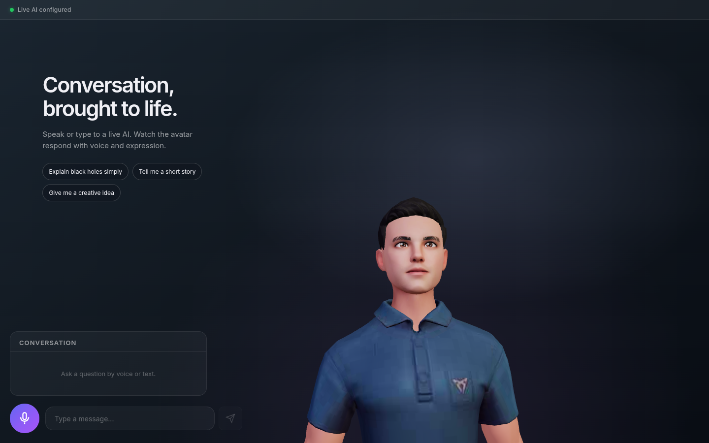

# Virtual Assistant

A live AI conversation with a 3D avatar. Ask a question by text or voice, read the streamed response, and hear the avatar speak. The browser never asks visitors for an API key.



The runnable project is [app/](app/). It uses React and Three.js in the browser, an Express server for the API key and provider calls, and NVIDIA chat, Parakeet transcription, and Magpie speech. There are no scripted demo answers.

## Run locally

Use Node.js 22+ and a server-side NVIDIA API key:

```bash
cd app
cp .env.example .env
# Add your server-side NVIDIA_API_KEY to .env
npm ci
npm run dev
```

Open `http://localhost:5173`. For a production-style run, use `npm run build && npm start` inside `app/`. The setup, deployment notes, and validation commands are in the [app guide](app/README.md).

The app shows the real service state. If the server or provider key is unavailable, it explains why live conversation cannot start. Text chat remains available when WebGL or speech output is unsupported.
